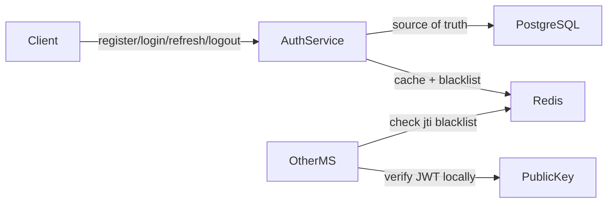
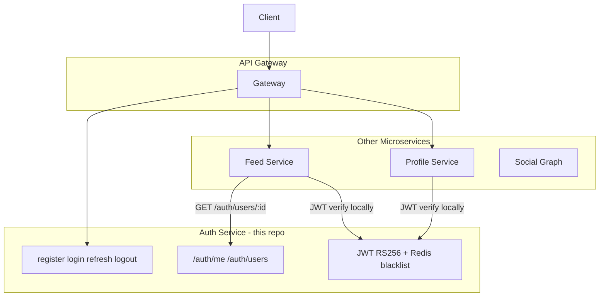

# Rednote Auth Service

JWT-based authentication microservice for the Rednote social media platform. Built with **Fastify**, **TypeScript**, **Prisma**, **PostgreSQL**, **Redis**, and **RS256** asymmetric JWTs.

## Architecture



### Revocation strategy

| Token type | Storage | Revocation |
|------------|---------|------------|
| **Refresh token** | SHA-256 hash in PostgreSQL (source of truth) + Redis cache | Mark `revoked=true` in Postgres, delete Redis key on logout/rotation |
| **Access token** | Stateless JWT (15 min TTL) | Add `jti` to Redis blacklist with TTL = remaining token life on logout |

Other microservices verify access tokens **locally** using the public key — no HTTP call to this service.

## Prerequisites

- Node.js 20+
- Docker & Docker Compose
- OpenSSL (for RSA key generation)

## Quick start

### 1. Start Postgres and Redis

```bash
docker compose up -d
```

### 2. Install dependencies

```bash
npm install
```

### 3. Configure environment

```bash
cp .env.example .env
```

### 4. Generate RSA key pair (RS256)

```bash
npm run keys:generate
```

This creates:

- `keys/private.pem` — **Auth Service only** (signs tokens)
- `keys/public.pem` — **All microservices** (verify tokens)

Manual generation:

```bash
openssl genrsa -out keys/private.pem 2048
openssl rsa -in keys/private.pem -pubout -out keys/public.pem
```

### 5. Run database migrations

```bash
npm run prisma:generate
npm run prisma:migrate
```

For production deployments:

```bash
npm run prisma:deploy
```

### 6. Start the server

```bash
npm run dev
```

The service listens on `http://localhost:3001` by default.

## Environment variables

| Variable | Required | Default | Description |
|----------|----------|---------|-------------|
| `NODE_ENV` | No | `development` | Runtime environment |
| `PORT` | No | `3001` | HTTP port |
| `DATABASE_URL` | Yes | — | PostgreSQL connection string |
| `REDIS_URL` | Yes | — | Redis connection string |
| `JWT_PRIVATE_KEY_PATH` | Yes | — | Path to RSA private PEM |
| `JWT_PUBLIC_KEY_PATH` | Yes | — | Path to RSA public PEM |
| `ACCESS_TOKEN_TTL_SECONDS` | No | `900` | Access token lifetime (15 min) |
| `REFRESH_TOKEN_TTL_SECONDS` | No | `604800` | Refresh token lifetime (7 days) |
| `CORS_ORIGINS` | No | `http://localhost:3000` | Comma-separated allowed origins |
| `REDIS_BLACKLIST_FAIL_MODE` | No | `closed` | `open` or `closed` when Redis is down |

## API endpoints

### POST /auth/register

```bash
curl -X POST http://localhost:3001/auth/register \
  -H "Content-Type: application/json" \
  -d '{"email":"user@example.com","username":"myuser","password":"password123"}'
```

Response `201`:

```json
{
  "access_token": "...",
  "refresh_token": "...",
  "expires_in": 900
}
```

### POST /auth/login

Accepts email **or** username in the `identifier` field.

```bash
curl -X POST http://localhost:3001/auth/login \
  -H "Content-Type: application/json" \
  -d '{"identifier":"user@example.com","password":"password123"}'
```

### POST /auth/refresh

Rotates the refresh token on every use.

```bash
curl -X POST http://localhost:3001/auth/refresh \
  -H "Content-Type: application/json" \
  -d '{"refresh_token":"..."}'
```

### POST /auth/logout

Requires `Authorization: Bearer <access_token>` and refresh token in body.

```bash
curl -X POST http://localhost:3001/auth/logout \
  -H "Authorization: Bearer <access_token>" \
  -H "Content-Type: application/json" \
  -d '{"refresh_token":"..."}'
```

### GET /auth/verify

Internal endpoint to test JWT verification logic.

```bash
curl http://localhost:3001/auth/verify \
  -H "Authorization: Bearer <access_token>"
```

### GET /auth/me

Returns the authenticated user's identity profile. **Email is never included.**

```bash
curl http://localhost:3001/auth/me \
  -H "Authorization: Bearer <access_token>"
```

Response `200`:

```json
{
  "id": "uuid",
  "username": "myuser",
  "role": "user",
  "created_at": "2026-06-28T...",
  "updated_at": "2026-06-28T..."
}
```

### GET /auth/users/:user_id

Public identity lookup by user ID (for feed, posts, and other microservices). Requires JWT.

```bash
curl http://localhost:3001/auth/users/<user_id> \
  -H "Authorization: Bearer <access_token>"
```

### GET /auth/users/by-username/:username

Public identity lookup by username.

```bash
curl http://localhost:3001/auth/users/by-username/myuser \
  -H "Authorization: Bearer <access_token>"
```

## Microservice architecture coverage

This auth service is designed as the **identity & token** layer. Here is what is covered and what belongs in other services:

| Concern | Covered here? | Where it lives |
|---------|---------------|----------------|
| Register / login / logout | Yes | Auth Service |
| JWT issue & refresh (RS256) | Yes | Auth Service |
| Token blacklist (Redis jti) | Yes | Auth Service |
| Local JWT verify (no HTTP call) | Yes | `verify.middleware.ts` for other services |
| User identity (id, username, role) | Yes | Auth Service (`/auth/me`, `/auth/users/*`) |
| Password hashing (argon2) | Yes | Auth Service |
| Rate limiting on auth endpoints | Yes | Auth Service |
| Swagger API docs | Yes | `/docs` |
| User profile (bio, avatar, cover) | No | **User/Profile Service** |
| Posts, feed, likes, comments | No | **Content/Feed Service** |
| Followers / following graph | No | **Social Graph Service** |
| Notifications | No | **Notification Service** |
| API gateway / routing | No | **Gateway** (Kong, nginx, etc.) |
| Service-to-service auth (mTLS, API keys) | No | Infrastructure layer |
| Email verification / password reset | No | Future auth feature or **Notification Service** |



**Pattern for other services:** verify JWT locally with the public key + Redis blacklist. Call Auth Service only when you need identity data (username, role) not present in the token.


Access tokens are signed with **RS256** and contain:

| Claim | Description |
|-------|-------------|
| `sub` | User UUID |
| `role` | User role (`user`, etc.) |
| `jti` | Unique token ID for blacklist/revocation |
| `iat` | Issued at |
| `exp` | Expiration |

No email, username, or other PII is included in the JWT payload.

## Verifying tokens in other microservices

Copy [`src/middleware/verify.middleware.ts`](src/middleware/verify.middleware.ts) into your service. Other services need only:

1. The **public PEM key** (`keys/public.pem`)
2. **Redis URL** (for jti blacklist checks)
3. No Postgres or Auth Service HTTP calls

```typescript
import { createVerifyJwtMiddleware } from "./middleware/verify.middleware.js";
import { readFileSync } from "node:fs";

const verifyJwt = createVerifyJwtMiddleware({
  public_key: readFileSync("./keys/public.pem"),
  redis_url: process.env.REDIS_URL,
  blacklist_fail_mode: "closed", // or "open" for higher availability
});

fastify.get("/protected", { preHandler: verifyJwt }, async (request) => {
  return { user_id: request.user!.user_id, role: request.user!.role };
});
```

### Blacklist fail modes

| Mode | Behavior when Redis is unavailable |
|------|-------------------------------------|
| `closed` (default) | Reject requests — more secure |
| `open` | Allow requests — higher availability, revoked tokens may pass |

## Security features

- **argon2id** password hashing
- **RS256** asymmetric JWTs with explicit algorithm whitelist
- Refresh tokens stored as **SHA-256 hashes** in Postgres (never plaintext)
- **Refresh token rotation** on every refresh
- **Rate limiting** on `/auth/login` and `/auth/register` (5 attempts / 15 min / IP)
- **Helmet** security headers
- **CORS** restricted to configured origins
- Generic login errors (`Invalid credentials`) — no user enumeration
- Parameterized queries via Prisma

## API documentation (Swagger)

With the server running:

| URL | Description |
|-----|-------------|
| `http://localhost:3001/docs` | Interactive Swagger UI |
| `http://localhost:3001/docs/json` | Raw OpenAPI JSON spec |

Export the spec to a file:

```bash
npm run docs:generate
# → docs/openapi.json
```

To try protected endpoints in Swagger UI: run **Register** or **Login**, copy `access_token`, click **Authorize**, and enter the token (Swagger adds the `Bearer` prefix automatically).

Swagger is enabled in development by default. Set `DOCS_ENABLED=true` in `.env` to enable in production.

## Testing

Ensure Redis is running locally (`redis-cli ping`), then:

```bash
npm test
```

Tests spin up an embedded Postgres instance automatically — Docker is not required for the test suite.

Tests cover register, login, refresh, logout, duplicate registration, tampered JWTs, expired refresh tokens, and the exportable verify middleware.

## Project structure

```
src/
├── index.ts                 # Server entry + buildApp() factory
├── config/env.ts            # Environment validation
├── plugins/                 # Fastify plugins (jwt, redis, prisma)
├── services/                # Auth and token business logic
├── routes/auth.routes.ts    # HTTP endpoints
├── middleware/verify.middleware.ts  # Reusable JWT verifier
├── types/                   # TypeScript types
└── utils/crypto.util.ts     # Token hashing utilities
prisma/
└── schema.prisma            # Database schema
test/
└── auth.test.ts             # Inject-based integration tests (uses embedded Postgres)
```

## Docker Compose services

| Service | Port | Credentials |
|---------|------|-------------|
| PostgreSQL 16 | 5432 | `auth` / `auth` / `auth_db` |
| Redis 7 | 6379 | No auth (local dev) |

```yaml
# docker-compose.yml excerpt
services:
  postgres:
    image: postgres:16-alpine
    environment:
      POSTGRES_USER: auth
      POSTGRES_PASSWORD: auth
      POSTGRES_DB: auth_db
  redis:
    image: redis:7-alpine
```
